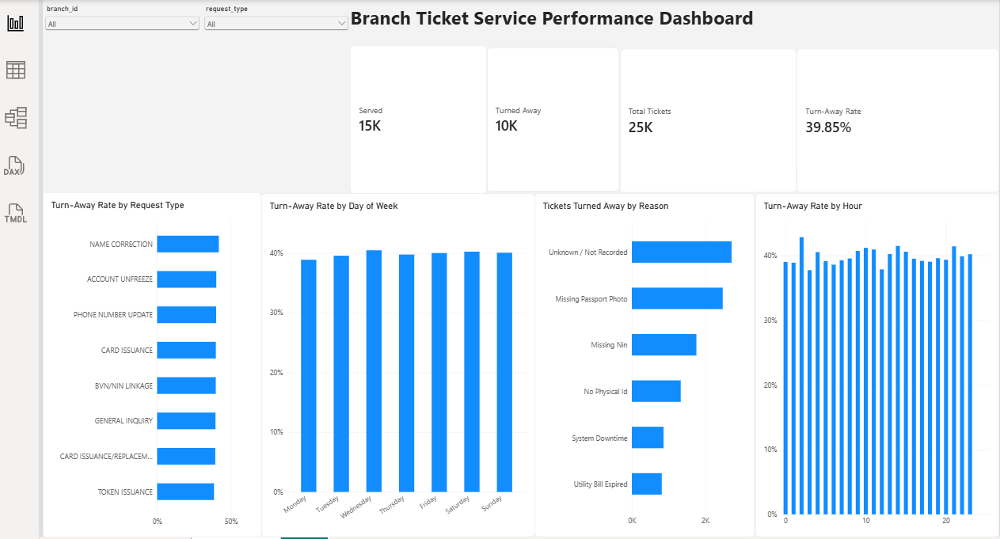

# Branch Ticket Analysis

SQL and Power BI analysis of customer ticket operations across bank branches.

## About the Project

I worked with branch ticket data to understand how customers were being served and why some tickets were being turned away.

The data was not clean when I started, so I first loaded it into PostgreSQL and worked through the data cleaning and quality checks before doing the analysis.

After cleaning the data, I used SQL to analyze the ticket information and then built a Power BI dashboard to make the results easier to understand.

## What I Wanted to Find Out

The main questions I wanted to answer were:

- How many tickets were served?
- How many were turned away?
- What is the overall turn-away rate?
- Which request types have higher turn-away rates?
- Does the turn-away rate change depending on the day?
- Does it change depending on the hour?
- Why are customers being turned away?
- How does performance differ across branches?
- What can the data tell us about customer wait times?

## Tools I Used

- PostgreSQL
- pgAdmin 4
- SQL
- Power BI
- DAX
- GitHub

## Data Cleaning

The original data had different formats and inconsistent values, so I had to clean it before using it for analysis.

Some of the things I worked on included:

- Checking for duplicates
- Checking missing values
- Removing unwanted spaces with `TRIM()`
- Standardizing text with `UPPER()`
- Cleaning inconsistent categories
- Standardizing values such as gender and state names
- Handling different date formats
- Checking the data types
- Checking relationships between the tables

I kept the cleaning and checking queries in the `sql` folder so the steps can be followed.

## SQL Analysis

I separated my SQL work into different files so it was easier to follow.

- `01_data_quality_checks.sql` — checks the quality of the data
- `02_cleaning.sql` — cleaning and standardizing the data
- `03_branch_analysis.sql` — looking at branch performance
- `04_wait_time_analysis.sql` — looking at customer wait times
- `05_turnaway_analysis.sql` — looking at why and when tickets were turned away
- `06_final_kpis.sql` — final KPI calculations

## Power BI Dashboard

After cleaning and analyzing the data, I created a Power BI dashboard to bring the main findings together.

The dashboard currently shows:

- Total Tickets
- Served Tickets
- Turned Away Tickets
- Turn-Away Rate
- Turn-Away Rate by Request Type
- Turn-Away Rate by Day of Week
- Tickets Turned Away by Reason
- Turn-Away Rate by Hour

There are also two filters that allow the dashboard to be viewed by:

- Branch
- Request Type

### Main Numbers

The overall dataset contains approximately:

- **25K Total Tickets**
- **15K Served**
- **10K Turned Away**
- **39.85% Turn-Away Rate**

### Dashboard



## What I Found

The overall turn-away rate was **39.85%**, which means a significant number of tickets were not served.

I also looked at how the turn-away rate changed across different request types, days of the week and hours of the day.

The reasons for customers being turned away were also useful because they showed that some turn-aways were connected to customer documentation or requirements, while others were related to operational issues.

There was also an **Unknown / Not Recorded** category in the data. I kept this category instead of guessing what the missing reasons were.

## What I Learned

This project helped me understand that data analysis is not just about creating charts.

A big part of the work was making sure the data was clean and reliable before using it.

I also got more practice with:

- SQL data cleaning
- PostgreSQL
- Working with messy data
- Data quality checks
- Writing SQL for analysis
- Creating DAX measures
- Building Power BI dashboards
- Turning data into business questions and findings

## Project Structure

```text
branch-ticket-analysis/
│
├── README.md
│
├── sql/
│   ├── 01_data_quality_checks.sql
│   ├── 02_cleaning.sql
│   ├── 03_branch_analysis.sql
│   ├── 04_wait_time_analysis.sql
│   ├── 05_turnaway_analysis.sql
│   └── 06_final_kpis.sql
│
├── powerbi/
│   └── Branch_Ticket_Service_Performance.pbix
│
└── screenshots/
    └── dashboard.png
